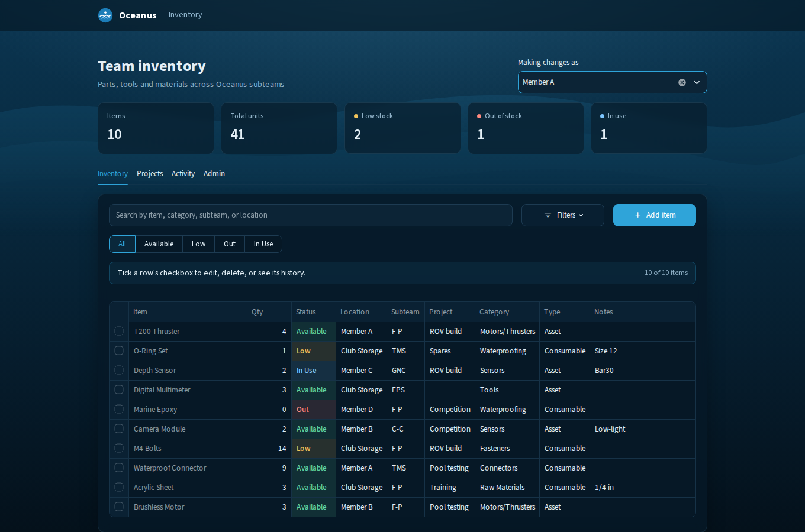
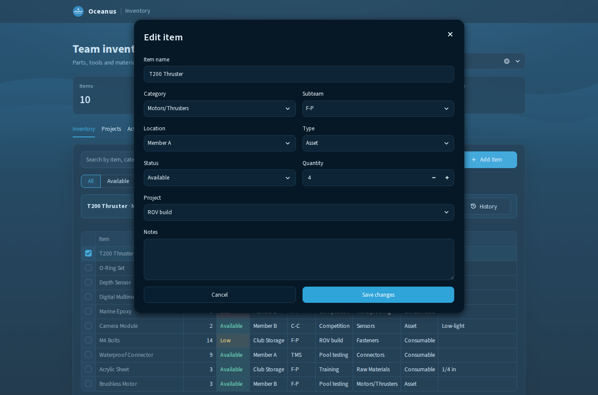
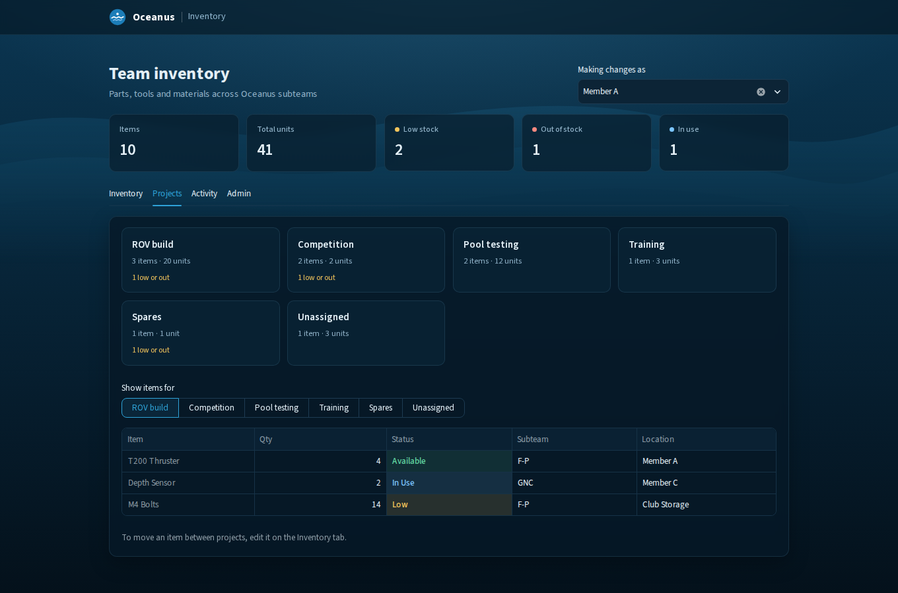
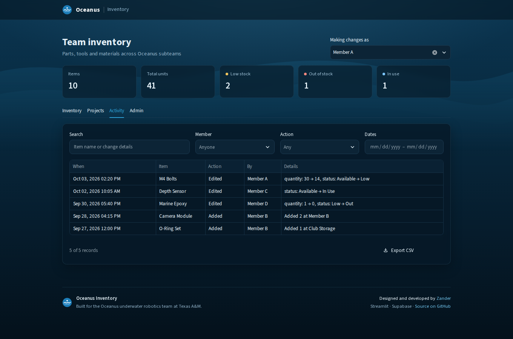
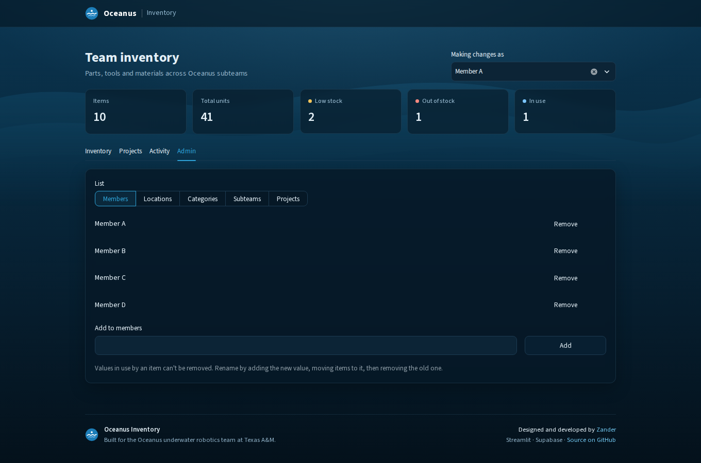
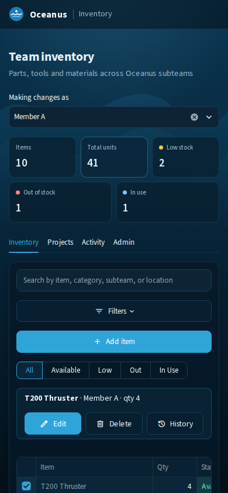

# Oceanus Inventory

[](https://github.com/zanderdhancock/Inventory_Management_System/actions/workflows/tests.yml)

An inventory system for the Oceanus underwater robotics team at Texas A&M. It tracks every part, tool and material the team owns, where each one is, which subteam and project it belongs to, and who changed what.



## Why it exists

Team inventory was spread across members' dorms, homes and the club storage room. Nobody could answer "do we have spare O-rings, and who has them?" without a group chat. This app gives the team one place to look it up and one place to record changes.

## Features

- **Inventory list** with search, filters (category, subteam, location, project) and quick status filters. Clicking a summary tile such as "Low stock" filters the list to those items.
- **Add, edit and delete in modals.** Tick a row and choose Edit, Delete or History. Every change asks who is making it.
- **Projects.** Allocate items to the ROV build, competition, pool testing and other projects, and see what each one holds.
- **Full activity history** with search, member, action and date filters, plus CSV export. Every add, edit and delete is kept.
- **Admin tab** for members, locations, categories, subteams and projects. A value that is still in use can't be removed.
- **Works on phones.** The layout adapts for checking stock at the pool or in the lab.

| Edit an item | Projects |
| --- | --- |
|  |  |

| Activity history | Admin |
| --- | --- |
|  |  |

<p align="center"></p>

## Architecture

```text
Browser
   │
Streamlit app (Python, Streamlit Community Cloud)
   ├── main.py         page flow, access gate, change handlers
   ├── components.py   UI: header, table, modals, tabs
   ├── inventory.py    search, filters, validation, history logic
   ├── database.py     Supabase queries
   ├── options.py      default lists and the editable-list loader
   └── styles.py       ocean theme
   │
Supabase (PostgreSQL)
   ├── inventory_items
   ├── inventory_history
   └── inventory_options
```

## Security model

- The app is gated by a team access code (`APP_ACCESS_CODE`), checked with a constant-time comparison.
- The app talks to Supabase only from the server, using the secret key (`SUPABASE_SECRET_KEY`). The key never reaches the browser.
- Row Level Security is enabled on every table, with no anonymous policies, so the public API key can't read or write data.
- Every change is attributed to a team member and kept in `inventory_history`.

## Running locally

```bash
pip install -r requirements.txt
cp .env.example .env    # then fill in the values
streamlit run main.py
```

`.env` needs:

```text
SUPABASE_URL=...
SUPABASE_SECRET_KEY=...
APP_ACCESS_CODE=...
```

When deployed, the same three values go in Streamlit Secrets.

## Database setup

Two one-time SQL scripts live in `supabase/`. Run them in the Supabase SQL editor; both are safe to re-run.

| Script | What it does |
| --- | --- |
| `2026-10-05_subsystems_to_subteams.sql` | Moves old subsystem names onto the five subteams |
| `2026-10-05_demo_features.sql` | Adds a `project` column to items, plus the `inventory_options` table for the Admin tab |

The app runs without the second script. Projects and the Admin tab simply stay hidden until it has been run.

## Testing

```bash
pip install -r requirements-dev.txt
pytest
```

GitHub Actions runs the tests on every push to `main` and on every pull request.

## Deployment

Pushing to `main` redeploys the app on Streamlit Community Cloud automatically.

## Credits

Designed and developed by [Zander](https://github.com/zanderdhancock) for the Oceanus underwater robotics team at Texas A&M. The same credit appears in the app's footer.

## Tech stack

Python 3.11, Streamlit 1.64, Supabase (PostgreSQL), pandas, pytest and GitHub Actions.
